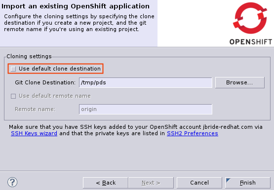
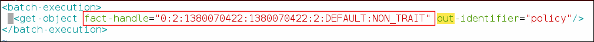
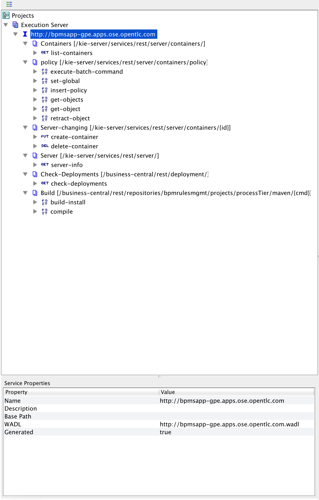
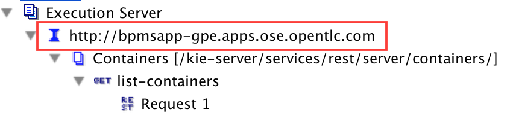
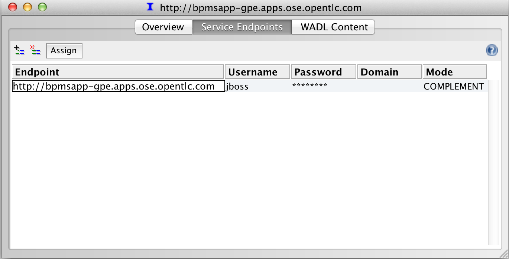
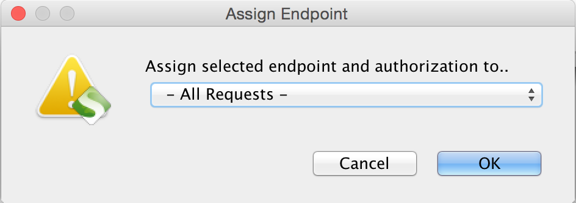

:data-uri:
:toc2:
:rhtlink: link:https://www.redhat.com[Red Hat]
:bugzilla: link:https://bugzilla.redhat.com/show_bug.cgi?id=1218461[BZ-1218461]
:bpmproduct: link:https://access.redhat.com/site/documentation/en-US/Red_Hat_JBoss_BPM_Suite/[Red Hat's BPM Suite 6 product]
:soapui: link:http://www.soapui.org/[SoapUI Tool]
:soapui-file: link:https://github.com/jboss-gpe-ref-archs/bpm_rulesMgmt/blob/6.1/rulesMgmt/src/test/resources/Execution-Server-soapui-project.xml[test file]
:drools-execution-server: link:http://blog.athico.com/2014/08/drools-execution-server-demo-620beta1.html[Drools Execution Server]
:kieserver: link:https://github.com/droolsjbpm/droolsjbpm-integration/tree/master/kie-server[drools kie server]
:ejbremotingreference: link:https://docs.jboss.org/author/display/AS71/Remote+EJB+invocations+via+JNDI+-+EJB+client+API+or+remote-naming+project[EJB Remoting Reference guide]
:mwlaboverviewsetup: link:http://people.redhat.com/jbride/labsCommon/setup.html[Middleware Lab Overview and Set-up]

image::images/rhheader.png[width=900]

:numbered!:
[abstract]
= BPM Rules Management

:numbered:

== Overview
Red Hat's Business Process Management (BPM) Suite 6 product is a super-set of it's Business Rules Management (BRM) Suite 6 product.
As such, both products include a rules engine (based on technology from the open-source Drools community projects).
BPM Suite 6 includes a _Realtime Decision Server_ that allows for remote invocation of its rules engine.

The purpose of this reference architecture is to provide examples on how to invoke the rules engine of BPM Suite 6 via its _Realtime Decision Server_.

=== LEGAL

. This project is copyright of Red Hat, Inc. and distributed with an Apache 2 license
. This project is maintained by Red Hat's Global Partner Enablement team
. This project is a community project with no contractual support obligations
. Please contact Red Hat to discuss support details for Red Hat's BPM Suite 6 product.

=== Rules Management Topics
. *Deployment Unit aware*
+
KIE projects are deployed as per your normal procedures using BPM Suite 6.
KIE Base and KIE Session specifics are configured during creation of the deployment unit.

+
Deployment Units are a BPM Suite 6 concept only.
Deployment unit functionality is not applicable to BRM Suite 6.

. *Domain Model Classes*
+
Add your domain model classes to the java classpath of the business-central web archive of BPM Suite 6.
This is typically done via either of the following:

.. add domain model libraries to `business-central.war/WEB-INF/lib`
.. add domain model libraries to `kie-server.war/WEB-INF/lib`
.. deploy your doman model libraries as static JBoss modules and define an explicit dependency in the business-central and kie-server web archives to this static JBoss module.

+
Related, there is not a need to define dependencies to your domain model classes in the pom.xml of your KIE project.
You may choose to define dependencies to your domain model in the pom.xml of your KIE project (ie:  for design-time requirements imposed by the various editors of the BPM Console).
However, this reference architecture does not inspect the classpath created by the KIE project when resolving classes, only the java classpath.

=== Directory Structure
This reference architecture includes the following directories:

. *domain*
+
Example application domain model classes used in this reference architecture to demonstrate capability of rules _Execution Server_.
These example domain model classes contain JAXB annotations for (un)marshalling between its XML and java object representations.

. *processTier*
+
Example KIE project that includes a single rule.
This example KIE project is invoked by remote clients via the Execution Server functionality provided by BPM Suite 6.

. *rulesMgmt*
+
Provides tests and xml used to call the rest endpoint. Also there is a soapUI project file that shows how to call the _Execution Server_.

== Pre-Requisites
The remainder of this documentation provides instructions for installation, configuration and execution of this reference architecture in Red Hat Partner Demo System (RHPDS).
The following is a list of pre-requisites:

. OPENTLC-SSO credentials
+
`OPENTLC-SSO` user credentials are used to log into the Red Hat Partner Demo System (RHPDS).
If you do not currently have an `OPENTLC-SSO` userId, please email: `OPEN-program@redhat.com`.

. Familiarity with Partner Demo System
+
If you are not already familiar with *Red Hat Partner Demo System (RHPDS)*, please execute what is detailed in the {mwlaboverviewsetup} guide.
Doing so will ensure that you are proficient with the tooling and workflow needed to complete this reference architecture in an OpenShift Platform as a Service environment.

. Familiarity with {bpmproduct}
. curl
. {soapui}

== Provision BPM Suite 6 application

. Open the `Openshift Explorer` panel of the `JBoss` perspective of JBDS
. Right-click on the previously created connection to `broker00.ose.opentlc.com`.
+
Using your `OPENTLC-SSO` credentials, a connection to `broker00.ose.opentlc.com` should already exist after having completed the {mwlaboverviewsetup} guide.

. Select: `New -> Application` .
+
Since you have already created a domain from the previous introductory lab, the workflow for creation of a new application will be slightly different than what you are used to.
In particular, the OSE plugin will not prompt you for the creation of a new domain.

. The following `New or existing OpenShift Application` pop-up should appear:
+
image::images/new_OSE_app_bpm.png[]

.. In the `Name` text box, enter: `bpmsapp`
.. From the `Type` drop-down, select: JBoss BPMS 6.0 (rhgpe-bpms-6.0)
.. From the `Gear profile` drop-down, select: pds_medium
. Click `Next`
. A new dialogue appears entitled `Set up Project for new OpenShift Aplication`.
+
Check the check box for `Disable automatic maven build when pushing to OpenShift`.
Afterwards, Click `Next`.

. A new dialogue appears entitled `Import an existing OpenShift application`.
+
Even though it will not be used, you will be forced to clone the remote git enabled project associated with your new OpenShift application.
Select a location on your local filesystem where the git enabled project should be cloned to.
+

. Click `Finish`
. The OSE plugin of JBDS will spin for a couple of minutes as the remote BPM Suite 6 enabled OpenShift application is created.
. Eventually, the OSE plugin will prompt with a variety of pop-up related details regarding your new application.
+
Click through all of them except when you come to the dialogue box entitled `Publish bpmsapp?`.
For this dialogue box, click `No`
+
image::images/publishbpmslab.png[]

=== BPM Suite 6 App Verification

. Using the `Remote System Explorer` perspective of JBDS, open an SSH terminal and tail the `bpms/standalone/log/server.log` of your remote BPM Suite 6 enabled OSE application
. Log messages similar to the following should appear:
+
image::images/newbpmlogfile.png[]

== Configuration

=== local: Clone this reference architecture
This reference architecture will be cloned both in your local computer as well as in your remote BPM Suite 6 Openshift environment.
To clone this reference architecture in your local environment, execute the following:

. Open the `Git` perspective of JBDS.
. In the `Git Repositories` panel, click the link that allows you to `Clone a Git Repository and add the clone to this view`
. A pop-up should appear with a name of `Source Git Repository`
. In the `URI` field, enter the following:
+
-----
https://github.com/jboss-gpe-ref-archs/bpm_rulesMgmt.git
-----

. Click `Next`
+

. Continue to click `Next` through the various screens
+
On the pop-up screen entitled `Local Destination`, change the default value of the `Directory` field to your preferred location on disk.
For the purposes of the remainder of these instructions, this directory on your local filesystem will be referred to as:  $REF_ARCH_HOME

. On the last screen of the `Clone Git Repository` pop-up, click `Finish`
+
Doing so will clone this `bpm_rulesMgmt` project to your local disk

. In JBDS, switch to the `Project Explorer` panel and navigate to:  `File -> Import -> Maven -> Existing Maven Projects`
. In the `Root Directory` field of the `Maven Projects` pop-up, navigate to the location on disk where the `bpm_rulesMgmt` project was just cloned to.
+
image::images/import_mvn_project.png[width="65%"]

. Click `next` through the various pop-up panels and finally `Finish`.
. Your `Project Explorer` panel should now include the following mavenized projects
+
image::images/maven_projects.png[width="50%"]

=== local: Build the Reference Architecture
This reference architecture includes various sub-projects that need to be built locally.
To build the various sub-projects, execute the following:

. In the `Project Explorer` panel of JBDS, right-click on the `parent` project
. Navigate to: `Run As -> Maven Install`
. In the `Console` panel, a `BUILD SUCCESS` log message should appear.
+
image::images/maven_build_success.png[]

=== BPM Suite 6: Deployment
Now that this reference architecture has been built locally, its artifacts need to be added to the classpath of the `business-central.war` and `kie-server.war` web applications of the remote BPM Suite 6 enabled OpenShift application.

Both web archives are found in the following BPM Suite 6 directory: `$JBOSS_HOME/standalone/deployments`

. In the `Project Explorer` panel of the `JBOSS` perspective of JBDS, right-click on the `domain/target/bpm_rulesMgmt_domain.jar` in `Project Explorer` and select `Copy`.
+
image::images/domainjar.png[]

. In the `Remote System Explorer` perspective of JBDS, navigate to `bpmsapp-<your domain>.apps.ose.opentlc.com -> Sftp Files -> My Home -> bpms -> standalone -> deployments -> business-central.war -> WEB-INF -> lib`
+
image::images/pastedomainjarintobizcentral.png[]
. Right-click and select `Paste`
. Repeat the previous steps to add the `bpm_rulesMgmt_domain.jar` to `kie-server.war/WEB-INF/lib`.
. Once the domain artifact has been added to the `WEB-INF/lib` directories of your remote BPM Suite 6 web apps, re-start the JVM:
.. Switch back to the `OpenShift Explorer` plugin of JBDS and right-click the `bpmsapp` application
.. Select `Restart Application`

=== BPM Suite 6: clone this Ref Arch
This reference architecture contains a few simple rules that can be used to smoke-test the `bpm_rulesMgmt` services.

. Navigate your browser to the BPM Console of your remote OpenShift application.
. Authenticate using a userId of `jboss` and a password of `brms`.
. clone this reference architecture in BPM Suite 6 and name the new git repository:  _bpmrulesmgmt_

=== BPM Suite 6:  compile _processTier_ KIE project
The _processTier_ KIE project needs to be compiled.
Do so as follows:

-----
curl -vv -u jboss:brms -X POST http://bpmsapp-<your.domain.name>.apps.ose.opentlc.com/business-central/rest/repositories/bpmrulesmgmt/projects/processTier/maven/compile
-----

response:

[source,json]
----
{   "jobId":"1431010737931-1",
    "status":"APPROVED",
    "repositoryName":"bpmsrulesmgmt",
    "projectName":"processTier"
}
----

=== Review *kmodule.xml*
. In the _BPM Console_ navigate to: `Authoring -> Administration -> File Explorer -> Repositories -> bpmsrulesmgmt`.
. Continue drill-down to: `processTier -> src -> main -> resource -> META-INF`
. Open: `kmodule.xml`
+
Notice that it defines two sessions: *stateful* (with name `ksession1`) and *stateless* (with name `ksession2`)
+
[source,xml]
-----
<kmodule xmlns="http://jboss.org/kie/6.0.0/kmodule" xmlns:xsi="http://www.w3.org/2001/XMLSchema-instance">
    <kbase name="kiebase" default="true" eventProcessingMode="cloud" equalsBehavior="identity">
    <ksession name="ksession1" type="stateful" default="true" clockType="realtime"/>
    <ksession name="ksession2" type="stateless" default="false" clockType="realtime"/>
    </kbase>
</kmodule>
-----
+
Note that the `stateful` session is *default*.

An explanation of when and why each session will be used will be provided later in this exercise.

== Test
=== Overview

. *Clients*
+
This reference architecture provides examples of how to invoke the BxMS _Execution Server_.
Examples are provided using the following HTTP clients :

.. <<curl>>
.. <<soapui>>

+
The examples provided using both clients are identical.
Which one you choose to use is based on personal preference.
In addition to curl and soapUI, any http client that allows for GET, POST, PUT and DELETE functions can be used.

. *bpmsapp-gpe.apps.ose.opentlc.com*
+
The test examples reference a DNS name of:  _bpmsapp-gpe.apps.ose.opentlc.com_.
+
_bpmsapp-gpe.apps.ose.opentlc.com_ is the name of the host where BPM Suite 6 is running when this reference architecture was created.
You will want to customize these example commands to use the IP address or DNS name of the host where your BPM Suite 6 environment is running.

. *BPM Suite 6 BASIC Auth*
+
The test examples reference a curl command-line parameter of:  *-u jboss:brms*.
+
_jboss:brms_  is the userId:password used by the curl utility to authenticate to the _business-central_ web archive of BPM Suite 6.
You will want to customize the value of -u userId:password so that curl can authenticate to your BPM Suite 6 environment.

. *Directory from which to execute the test commands*
+
The test examples assume that they are being executed from a command terminal at the root directory of this reference architecture ($REF_ARCH_HOME).

[[curl]]
=== Sample RESTful Test Commands Using Curl

*sanity check*:  ensure that the REST service is properly started:

-----
curl -v -u jboss:brms -X GET http://bpmsapp-gpe.apps.ose.opentlc.com/kie-server/services/rest/server/
-----

response:

[source,xml]
-----
<?xml version="1.0" encoding="UTF-8" standalone="yes"?>
<response msg="Kie Server info" type="SUCCESS">
	<kie-server-info>
		<version>6.2.0.Final-redhat-3</version>
	</kie-server-info>
</response>
-----

==== Stateful KIE Session
A Stateful KIE session is the default session strategy.
This session strategy provides a single KIE Session whose scope is a `kie-container`.
Operations on a Singleton KIE session (ie:  setGlobal, insertFact, fireAllRules, etc) are synchronized.
This strategy is ideal for rule use cases that involve large number of facts / rules and where it is desirable that the session not be disposed.

This section of the exercise tests the BxMS Rules Execution Server using a `stateful` session.

. *create container*: create a container to be the specific entry point resource REST for the project.
+
-----
curl -v -u jboss:brms -X PUT -H "Content-Type:application/xml" -d @rulesMgmt/src/test/resources/CreateContainer.xml http://bpmsapp-gpe.apps.ose.opentlc.com/kie-server/services/rest/server/containers/policy
-----
+
response:
+
[source,xml]
----
<?xml version="1.0" encoding="UTF-8" standalone="yes"?>
<response msg="Container policy successfully deployed with module com.redhat.gpe.refarch.bpm_rulesMgmt:processTier:1.0." type="SUCCESS">
	<kie-container container-id="policy" status="STARTED">
		<release-id>
			<artifact-id>processTier</artifact-id>
			<group-id>com.redhat.gpe.refarch.bpm_rulesMgmt</group-id>
			<version>1.0</version>
		</release-id>
		<resolved-release-id>
			<artifact-id>processTier</artifact-id>
			<group-id>com.redhat.gpe.refarch.bpm_rulesMgmt</group-id>
			<version>1.0</version>
		</resolved-release-id>
	</kie-container>
</response>
----

. *List containers*: list all containers created.
+
-----
curl -v -u jboss:brms -X GET http://bpmsapp-gpe.apps.ose.opentlc.com/kie-server/services/rest/server/containers/
-----
+
response:
+
[source,xml]
----
<?xml version="1.0" encoding="UTF-8" standalone="yes"?>
<response msg="List of created containers" type="SUCCESS">
	<kie-containers>
		<kie-container container-id="policy" status="STARTED">
			<release-id>
				<artifact-id>processTier</artifact-id>
				<group-id>com.redhat.gpe.refarch.bpm_rulesMgmt</group-id>
				<version>1.0</version>
			</release-id>
			<resolved-release-id>
				<artifact-id>processTier</artifact-id>
				<group-id>com.redhat.gpe.refarch.bpm_rulesMgmt</group-id>
				<version>1.0</version>
			</resolved-release-id>
		</kie-container>
	</kie-containers>
</response>
----

. *Insert global*:
+
insert an application specific global (called: pGlobal) into the working memory of the rules engine assigned to stateful session:
+
-----
curl -v -u jboss:brms -X POST -H "Content-Type:application/xml" -d @rulesMgmt/src/test/resources/PolicyGlobal.xml http://bpmsapp-gpe.apps.ose.opentlc.com/kie-server/services/rest/server/containers/policy
-----
+
response:
+
[source,xml]
----
<?xml version="1.0" encoding="UTF-8" standalone="yes"?>
<response msg="Container policy successfully called." type="SUCCESS">
	<results>&lt;execution-results/&gt;</results>
</response>
----

. *Insert fact*:
+
insert an application specifc fact (called: policy) into the working memory of the rules engine assigned to the stateful session:
+
-----
curl -v -u jboss:brms -X POST -H "Content-Type:application/xml" -d @rulesMgmt/src/test/resources/Policy.xml http://bpmsapp-gpe.apps.ose.opentlc.com/kie-server/services/rest/server/containers/policy
-----
+
response:
+
[source,xml]
-----
<response type="SUCCESS" msg="Container policy successfully called.">
   <results><![CDATA[<execution-results>
  <result identifier="policy">
    <com.redhat.gpe.refarch.bpm__rulesMgmt.domain.Policy>
      <policyId>4</policyId>
      <policyName>azra policy</policyName>
    </com.redhat.gpe.refarch.bpm__rulesMgmt.domain.Policy>
  </result>
  <fact-handle identifier="policy" external-form="0:7:2102535295:2102535295:7:DEFAULT:NON_TRAIT"/>
</execution-results>]]></results>
</response>
-----
+
[NOTE]
Pay particular attention to the value of *external-form*.
This value is used later in the lab exercise when getting and deleting this fact.

. *fireAllRules*: fire all rules included in the working memory of the rules engine assigned to the stateful session.
+
-----
curl -v -u jboss:brms -X POST -H "Content-Type:application/xml" -d @rulesMgmt/src/test/resources/FireAllRules.xml http://bpmsapp-gpe.apps.ose.opentlc.com/kie-server/services/rest/server/containers/policy
-----
+
response:
+
[source,xml]
----
<?xml version="1.0" encoding="UTF-8" standalone="yes"?>
<response msg="Container policy successfully called." type="SUCCESS">
	<results>&lt;execution-results/&gt;</results>
</response>
----
+
NOTE: Check the server log to see that the value defined in the PolicyGlobal.xml for sleepTime attribute was printed as 0 properly according to the testRule.drl.
+
----
19:00:50,108 INFO  [stdout] (http-/127.0.0.1:8080-7) testRule() sleepTime = 0
19:00:50,109 INFO  [stdout] (http-/127.0.0.1:8080-7) testRule() done sleeping
----

. *get objects*: return a Collection of all the facts presently in the working memory of the rules engine.
+
-----
curl -v -u jboss:brms -X POST -H "Content-Type:application/xml" -d @rulesMgmt/src/test/resources/GetObjects.xml http://bpmsapp-gpe.apps.ose.opentlc.com/kie-server/services/rest/server/containers/policy
-----
+
response:
+
[source,xml]
----
<response type="SUCCESS" msg="Container policy successfully called.">
   <results><![CDATA[<execution-results>
  <result identifier="policy">
    <list>
      <com.redhat.gpe.refarch.bpm__rulesMgmt.domain.Policy>
        <policyId>4</policyId>
        <policyName>azra policy</policyName>
      </com.redhat.gpe.refarch.bpm__rulesMgmt.domain.Policy>
      <com.redhat.gpe.refarch.bpm__rulesMgmt.domain.Policy>
        <policyId>4</policyId>
        <policyName>azra policy</policyName>
      </com.redhat.gpe.refarch.bpm__rulesMgmt.domain.Policy>
    </list>
  </result>
</execution-results>]]></results>
</response>
----

. *Get fact*:
+
Given a fact handle, get the corresponding _policy_ fact from the working memory of the rules engine assigned to a stateful session.

.. Modify the value of the `fact-handle` attribute in the request payload.
+
Edit `rulesMgmt/src/test/resources/GetObject.xml` such that the value of the `fact-handle` attribute corresponds to the value of the `external-form` attribute provided when the fact was initially inserted.
+

.. Execute:
+
-----
curl -v -u jboss:brms -X POST -H "Content-Type:application/xml" -d @rulesMgmt/src/test/resources/GetObject.xml http://bpmsapp-gpe.apps.ose.opentlc.com/kie-server/services/rest/server/containers/policy
-----
+
response:
+
[source,xml]
----
<response type="SUCCESS" msg="Container policy successfully called.">
   <results><![CDATA[<execution-results>
  <result identifier="policy">
    <com.redhat.gpe.refarch.bpm__rulesMgmt.domain.Policy>
      <policyId>4</policyId>
      <policyName>azra policy</policyName>
    </com.redhat.gpe.refarch.bpm__rulesMgmt.domain.Policy>
  </result>
</execution-results>]]></results>
</response>
----

. *delete specific fact*:
+
given a fact handle, remove corresponding fact presently in the working memory of the rules engine assigned to the stateful session.

.. Modify the value of the `fact-handle` attribute in the request payload.
+
Similar to the previous step, edit: `rulesMgmt/src/test/resources/RetractObject.xml`

.. Execute:
+
-----
curl -v -u jboss:brms -X POST -H "Content-Type:application/xml" -d @rulesMgmt/src/test/resources/RetractObject.xml http://bpmsapp-gpe.apps.ose.opentlc.com/kie-server/services/rest/server/containers/policy
-----
+
response:
+
[source,xml]
----
<?xml version="1.0" encoding="UTF-8" standalone="yes"?>
<response msg="Container policy successfully called." type="SUCCESS">
	<results>&lt;execution-results/&gt;</results>
</response>
----

[TIP]
In order for facts to be returned the following attributes need to be included in the initial BatchExecutionCommand payload:
`return-object="true"` and `out-identifier="<your identifier>"`

==== Stateless KIE Session
Some rules use-cases are better served with a Stateless KIE session where the life of the session is a single transaction.
When using a Stateless session, all commands to that session (ie:  insert fact, global, fireAllRules, etc) need to occur within the scope of that transaction.

We will execute a batch command that adds the facts and fire all rules.
Afterwards, we will try to get a fact by its fact handle id.
The expected behavior is that the fact does not exist since the session used was defined as stateless.

This batch command supports use-cases requiring a Stateless KIE Session.

The HTTP payload consists of an XML representation of the `org.kie.api.command.BatchExecutionCommand`.
All batch commands included in the http payload are executed in the Stateless KIE session in a single transaction.

Pay attention to the attribute `lookup` both in the `CommandsStateless.xml` and `GetObjectStateless.xml` files.
This attribute references the session to use (ie: `ksession1` or `ksession2`).
Recall, that sessions were defined previously in the `kmodule.xml` file descriptor.
In particular, the stateless session is called `ksession2`.
Subsequently, for this section of the exercise, the payload of each request must include an attribute of: `lookup="ksession2"`.

[source,xml]
------
<batch-execution lookup="ksession2">
------

. *Execute batch command*:
.. The request command will be:
+
------
curl -v -u jboss:brms -X POST -H "Content-Type:application/xml" -d @rulesMgmt/src/test/resources/CommandsStateless.xml "http://bpmsapp-gpe.apps.ose.opentlc.com/kie-server/services/rest/server/containers/policy"
------
+
response:
+
[source,xml]
------
<response type="SUCCESS" msg="Container policy successfully called.">
   <results><![CDATA[<execution-results>
  <result identifier="policyOut">
    <com.redhat.gpe.refarch.bpm__rulesMgmt.domain.Policy>
      <policyId>234</policyId>
      <policyName>werwer</policyName>
    </com.redhat.gpe.refarch.bpm__rulesMgmt.domain.Policy>
  </result>
  <result identifier="driverOut">
    <com.redhat.gpe.refarch.bpm__rulesMgmt.domain.Driver>
      <driverId>234234</driverId>
      <driverName>azra</driverName>
    </com.redhat.gpe.refarch.bpm__rulesMgmt.domain.Driver>
  </result>
  <fact-handle identifier="policyOut" external-form="0:7:1162652775:1162652775:7:DEFAULT:NON_TRAIT"/>
  <fact-handle identifier="driverOut" external-form="0:8:751485372:751485372:8:DEFAULT:NON_TRAIT"/>
</execution-results>]]></results>
</response>
------
+
NOTE: Pay attention to the attribute `external-form` of the `policyOut` identifier. We will pass the `external-form` id returned in the last command and follow the instructions, and we should see a null return for the fact.

.. Modify the value of the `fact-handle` attribute in the request payload.
+
Edit `rulesMgmt/src/test/resources/GetObjectStateless.xml` such that the value of the `fact-handle` attribute corresponds to the value of the `external-form` attribute provided when the fact was initially inserted by previous batch command.
+
.. Execute:
+
-----
curl -v -u jboss:brms -X POST -H "Content-Type:application/xml" -d @rulesMgmt/src/test/resources/GetObjectStateless.xml http://bpmsapp-gpe.apps.ose.opentlc.com/kie-server/services/rest/server/containers/policy
-----
+
response:
+
[source,xml]
------
<response type="SUCCESS" msg="Container policy successfully called.">
   <results><execution-results>
  <result identifier="policy">
    <null/>
  </result>
</execution-results></results>
</response>
------

[[soapui]]
=== Sample RESTful Test Commands using SoapUI

This reference architecture provides a {soapui-file} to execute same commands provided as curl command line tool. The intention is to give Windows users the ability to test calls using {soapui}, which is a client REST/SOAP to create requests and inspect responses.

The {soapui-file} can be directly opened into SoapUI. You should see the following project:

. Before start execute requests, you may need to change the base url of your REST endpoints and change the user/password credentials. To change that globally click twice in the base url:

[start=2]
. Then select the *Sevice Endpoints* tab.

[start=3]
. After change the url to your instance url and change the username/password properly, click in *Assign*.

[start=4]
. Select the option  *-All Requests-* and click Ok.

. Now you can execute in the same order the commands described in the steps that refer to use curl.
