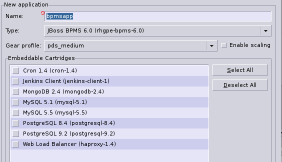
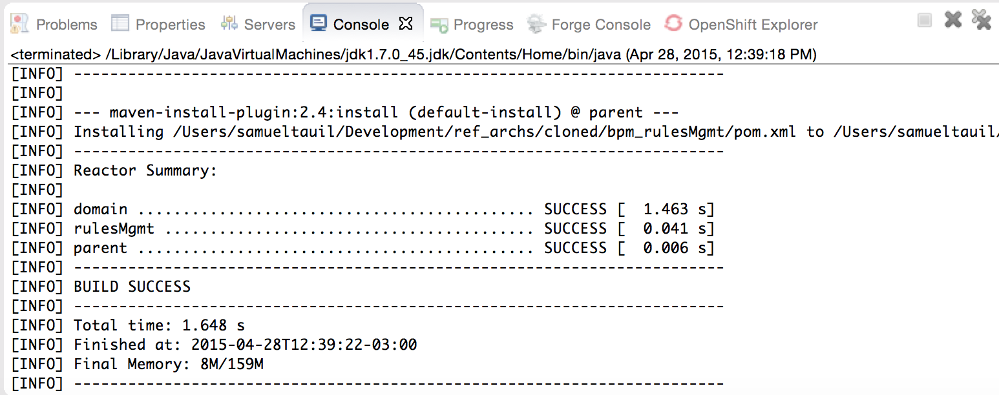

:data-uri:
:toc2:
:rhtlink: link:https://www.redhat.com[Red Hat]
:bpmproduct: link:https://access.redhat.com/site/documentation/en-US/Red_Hat_JBoss_BPM_Suite/[Red Hat's BPM Suite 6 product]
:dockerbpms: link:https://github.com/jboss-gpe-ose/docker_bpms/blob/master/doc/userguide.adoc[docker_bpms]
:irulesmgmt: link:../common/src/main/java/org/kie/services/remote/cdi/IRulesMgmt.java[IRulesMgmt]
:irulesmgmtservice: link:../common/src/main/java/com/redhat/gpe/refarch/bpm_rulesMgmt/IRulesMgmtService.java[IRulesMgmtService]
:drools-execution-server: link:http://blog.athico.com/2014/08/drools-execution-server-demo-620beta1.html[Drools Execution Server]
:kieserver: link:https://github.com/droolsjbpm/droolsjbpm-integration/tree/master/kie-server[drools kie server]
:ejbremotingreference: link:https://docs.jboss.org/author/display/AS71/Remote+EJB+invocations+via+JNDI+-+EJB+client+API+or+remote-naming+project[EJB Remoting Reference guide]
:mwlaboverviewsetup: link:http://people.redhat.com/jbride/labsCommon/setup.html[Middleware Lab Overview and Set-up]

image::images/rhheader.png[width=900]

:numbered!:
[abstract]
= BPM Rules Management

:numbered:

== Overview
Red Hat's Business Process Management (BPM) Suite 6 product is a super-set of it's Business Rules Management (BRM) Suite 6 product.
As such both products include a rules engine (based on technology from the open-source Drools community projects).
BPM Suite 6 includes an _Execution Server_ that allows for remote invocation of its process engine only.
The BPM Suite 6 Execution Server does not allow for remote invocation of its rules engine.

Targeted for the upstream community 6.2.Final release of drools is a new {drools-execution-server}.
Once merged into a supported BRMS release, this reference architecture becomes obsolete.

The purpose of this reference architecture is to provide a remoteable API to invoke the rules engine of BPM Suite 6.
This rules management API functionality can be considered an extension to the existing out-of-the-box Execution Server of BPM Suite 6.

=== LEGAL

. This project is copyright of Red Hat, Inc. and distributed with an Apache 2 license
. This project is maintained by Red Hat's Global Partner Enablement team
. This project is a community project with no contractual support obligations
. Please contact Red Hat to discuss support details for Red Hat's BPM Suite 6 product.

=== Rules Management Topics
. *Deployment Unit aware*
+ 
This rules management API functionality can be considered an extension to the existing out-of-the-box Execution Server of BPM Suite 6.
Similar to the existing BPM Suite 6 Execution Server, the Rules Management CDI bean provided by this project is _Deployment Unit_ aware.
KIE projects are deployed as per your normal procedures using BPM Suite 6.
KIE Base and KIE Session specifics are configured during creation of the deployment unit.
The Rules Management CDI bean provided by this project then allows for remote invocation of the rules engine assigned to that deployment unit.

+
Deployment Units are a BPM Suite 6 concept only.
Deployment unit functionality is not applicable to BRM Suite 6.
Subquently, this bpm_rulesMgmt functionality is applicable to BPM Suite 6 only.

+
The RulesMgmt CDI bean is itself injected with the following CDI bean at run-time:  org.kie.remote.services.cdi.DeploymentInfoBean.
This DeploymentInfoBean listens for and manages the state of DeploymentUnits in the Execution Server of BPM Suite 6.
Subsequently, the RulesMgmt CDI bean provided in this project is intended to be co-located with the Execution Server of BPM Suite 6.
Specifically, the _bpm_rulesMgmt.jar_ library provided by this project will be added to the business-central.war/WEB-INF/lib directory of BPM Suite 6 (discussed in the _set-up_ section of this documentation).

. *Supports SINGLETON and PER_REQUEST scoped KIESessions*
+
Many rules use-cases benefit from a SINGLETON KIESession whose scope is the life of a BPM Suite 6 Deployment Unit.
Some use-cases however are better served with a PER_REQUEST KIE session where the life of the session is a single transaction.
When using a PER_REQUEST session, all commands to that session (ie:  insert fact, global, fireAllRules, etc) need to occur within the scope of that transaction.
Since a PER_REQUEST KIE Session will never be re-used, its state is not persisted to a database as it is with SINGLETON and PER_PROCESS_INSTANCE strategies.
A PER_REQUEST KIE Session incurs minimal over-head and allows for concurrency.

This reference architecture provides an API that allows for interaction with both SINGELTON and PER_REQUEST KIE sessions.

. *API*
+
The API provided by the Rules Management CDI bean is straight-forward.
Details of each function can be found in the {irulesmgmt} interface.

. *Domain Model Classes*
+
Add your domain model classes to the java classpath of the business-central web archive of BPM Suite 6.
This is typically done via either of the following:

.. add domain model libraries to business-central.war/WEB-INF/lib
.. deploy your doman model libraries as static JBoss modules and define an explicit dependency in the business-central web archive to this static JBoss module.

+
Related, there is not a need to define dependencies to your domain model classes in the pom.xml of your KIE project.
You may choose to define dependencies to your domain model in the pom.xml of your KIE project (ie:  for design-time requirements imposed by the various editors of the BPM Console).
However, this ruleMgmt API does not inspect the classpath created by the KIE project when resolving classes .... only the java classpath.

+
Some RESTful resources require the addition of a _fqn_ or _fqns_ query parameter to the URL.
These _fqn_ parameters are used when constructing the JAXB Context used to (un)marshall your domain model classes.

=== Alternatives
The {kieserver} project is expected to be included in BRM Suite 6.1 .
This functionality will be a leaner implementation of the existing BPM Suite 6 Execution Server and more suitable for cloud environments.
The current BPM exec server includes a lot of dependencies that will be eliminated in this new implementation.

=== Directory Structure
This reference architecture includes the following directories:

. *common*
+
This reference architecture includes an {irulesmgmt} interface.
This IRulesMgmt interface is implemented by a CDI bean that manages the rules engine assigned to a _Deployment Unit_ .
The IRulesMgmt interface and CDI bean implementation are generic and should not require customization.
+
This reference architecture also includes an {irulesmgmtservice} interface.
Its implementation is an EJB that wraps transaction and remoting capabilties around the core rules management CDI bean.
This IRulesMgmtService is also generic and should not require customization.
If your application makes use of EJB clients (either local or remote), then this is the interface to invoke.

. *domain*
+
Example application domain model classes used in this reference architecture to demonstrate capability of Rules Management API functionality.
These example domain model classes contain JAXB annotations for (un)marshalling between its XML and java object representations.
JAXB annotations in your domain model are a requirement if using the RESTful API provided by this reference architecture.

. *processTier*
+
Example KIE project that includes a single rule.
This example KIE project is invoked by remote clients via the rules management API functionality provided in this reference architecture.

. *rulesMgmt*:  Provides the following:
+
image::images/refarchlayers.png[]

.. *Rules Management CDI bean*
+
Similar to the existing BPM Suite 6 Execution Server, this Rules Management CDI bean is _Deployment Unit_ aware.
The Rules Management CDI bean is generic in the sense that its API specifies java.lang.Object to insert facts and globals into the working memory of the rules engine.
The Rules Management CDI bean can be wrapped and exposed using a variety of different transports.
ie:  A user of this reference architecture may elect to expose this Rules Management CDI bean as a SOAP and/or JMS service.

.. *Rules Management EJB Service*
+
Allows for local and/or remote EJB clients to invoke the Rules Management API in a performant, transactional manner.
If an application needs the rulesMgmt functionality to participate in an 2-phase commit transaction, integration with this EJB interface is recommended.

.. *Rules Management RESTful service*
+
Allows for invocation of the Rules Management API via http.
Introduces over-head of JAXB (un)marshalling of an applications domain model.

.. *ejb-client*
+
Contains a sample EJB java client that invokes the RulesManagement EJB Service directly (and by-passes the RESTful interface of this solution).

== Pre-Requisites
The remainder of this documentation provides instructions for installation, configuration and execution of this reference architecture in Red Hat's Partner Demo System.
The following is a list of pre-requisites:

. OPENTLC-SSO credentials
+
`OPENTLC-SSO` user credentials are used to log into the Red Hat Partner Demo System (PDS).
If you do not currently have an `OPENTLC-SSO` userId, please email: `OPEN-program@redhat.com`.

. Familiarity with Partner Demo System
+
If you are not already familiar with Red Hat's `Partner Demo System`, please execute what is detailed in the {mwlaboverviewsetup} guide.
Doing so will ensure that you are proficient with the tooling and workflow needed to complete this reference architecture in an OpenShift Platform as a Service environment.

. Familiarity with {bpmproduct}
. curl

== Provision BPM Suite 6 application

. Open the `Openshift Explorer` panel of the `JBoss` perspective of JBDS
. Right-click on the previously created connection to `broker00.ose.opentlc.com`.
+
Using your `OPENTLC-SSO` credentials, a connection to `broker00.ose.opentlc.com` should already exist after having completed the {mwlaboverviewsetup} guide.

. Select: `New -> Application` .
+
Since you have already created a domain from the previous introductory lab, the workflow for creation of a new application will be slightly different than what you are used to.
In particular, the OSE plugin will not prompt you for the creation of a new domain.

. The following `New or existing OpenShift Application` pop-up should appear:
+

.. In the `Name` text box, enter: `bpmsapp`
.. From the `Type` drop-down, select: JBoss BPMS 6.0 (rhgpe-bpms-6.0)
.. From the `Gear profile` drop-down, select: pds_medium
. Click `Next`
. A new dialogue appears entitled `Set up Project for new OpenShift Aplication`.
+
Check the check box for `Disable automatic maven build when pushing to OpenShift`.
Afterwards, Click `Next`.

. A new dialogue appears entitled `Import an existing OpenShift application`.
+
Even though it will not be used, you will be forced to clone the remote git enabled project associated with your new OpenShift application.
Select a location on your local filesystem where the git enabled project should be cloned to.
+
image::images/gitclonelocation_bpm.png[]

. Click `Finish`
. The OSE plugin of JBDS will spin for a couple of minutes as the remote BPM Suite 6 enabled OpenShift application is created.
. Eventually, the OSE plugin will prompt with a variety of pop-up related details regarding your new application.
+
Click through all of them except when you come to the dialogue box entitled `Publish bpmsapp?`.
For this dialogue box, click `No`
+
image::images/publishbpmslab.png[]

=== BPM Suite 6 App Verification

. Using the `Remote System Explorer` perspective of JBDS, open an SSH terminal and tail the `bpms/standalone/log/server.log` of your remote BPM Suite 6 enabled OSE application
. Log messages similar to the following should appear:
+
image::images/newbpmlogfile.png[]

== Configuration and Execution

=== local: Clone this reference architecture
This reference architecture will be cloned both in your local computer as well as in your remote BPM Suite 6 Openshift environment.
To clone this reference architecture in your local environment, execute the following:

. Open the `Git` perspective of JBDS.
. In the `Git Repositories` panel, click the link that allows you to `Clone a Git Repository and add the clone to this view`
. A pop-up should appear with a name of `Source Git Repository`
. In the `URI` field, enter the following:
+
-----
https://github.com/jboss-gpe-ref-archs/bpm_rulesMgmt.git
-----

. Click `Next`
+
image::images/clone_repo_to_local.png[]

. Continue to click `Next` through the various screens
+
On the pop-up screen entitled `Local Destination`, change the default value of the `Directory` field to your preferred location on disk.
For the purposes of the remainder of these instructions, this directory on your local filesystem will be referred to as:  $REF_ARCH_HOME

. On the last screen of the `Clone Git Repository` pop-up, click `Finish`
+
Doing so will clone this `bpm_jms_exec_server` project to your local disk

. In JBDS, switch to the `Project Explorer` panel and navigate to:  `File -> Import -> Maven -> Existing Maven Projects`
. In the `Root Directory` field of the `Maven Projects` pop-up, navigate to the location on disk where the `bpm_jms_exec_server` project was just cloned to.
+
image::images/import_mvn_project.png[]

. Click `next` through the various pop-up panels and finally `Finish`.
. Your `Project Explorer` panel should now include the following mavenized projects
+
image::images/maven_projects.png[]

=== local: Build the Reference Architecture
This reference architecture includes various sub-projects that need to be built locally.
To build the various sub-projects, execute the following:

. In the `Project Explorer` panel of JBDS, right-click on the `parent` project
. Navigate to: `Run As -> Maven Install`
. In the `Console` panel, a `BUILD SUCCESS` log message should appear.
+

=== BPM Suite 6: Domain jar deployment
This reference architecture includes a subproject called `domain`.
This sub-project contains a maven build file along with the application specific domain classes for this reference architecture.
In `Project Explorer`, examine the domain classes and notice that they include Java Architecture for XML Binding (JAXB) annotations.

The following are directions for deploying the jar file to your remote BPM Suite 6 server running in OpenShift.

From your local cloned copy of this reference architecture execute the following:

. In the `Project Explorer` panel of the `JBOSS` perspective of JBDS, right-click on the `domain/target/domain-1.0.jar` in `Project Explorer` and select `Copy`.
+

. In the `Remote System Explorer` perspective of JBDS, navigate to `bpmsapp-<your domain>.apps.ose.opentlc.com -> Sftp Files -> My Home -> bpms -> standalone -> deployments -> business-central.war -> WEB-INF -> lib`
. Right-click and select `Paste`
+

. copy project libraries to _business-central_ web archive
+
-----
cp domain/target/bpm_rulesMgmt_domain.jar $JBOSS_HOME/standalone/deployments/business-central.war/WEB-INF/lib
cp common/target/bpm_rulesMgmt_common.jar $JBOSS_HOME/standalone/deployments/business-central.war/WEB-INF/lib
cp rulesMgmt/target/bpm_rulesMgmt.jar $JBOSS_HOME/standalone/deployments/business-central.war/WEB-INF/lib
-----

. Re-start BPM Suite 6

=== BPM Suite 6: clone this Ref Arch

. clone this reference architecture in BPM Suite 6 and name the new git repository:  _bpmrulesmgmt_
. build the _processTier_ KIE project included in this reference architecture.
+
-----
curl -vv -u jboss:brms -X POST http://docker_bpms:8080/business-central/rest/repositories/bpmrulesmgmt/projects/processTier/maven/compile
-----

== Test
This reference architecture includes a RESTful interface to manage the rules engine assigned to a Deployment Unit.

=== Test Details

. *curl*
+
Because this reference architecture provides an example RESTful interface, the command line curl utility is used to show-case this RESTful API.
Any http client that allows for GET, POST and DELETE functions can be used, however.

. *docker_bpms*
+
The test examples reference a DNS name of:  _docker_bpms_.
_docker_bpms_ is the name of the host where BPM Suite 6 is running.
You will want to customize these example commands to use the IP address or DNS name of the host where your BPM Suite 6 environment is running. 

. *BPM Suite 6 BASIC Auth*
+
The test examples reference a curl command-line parameter of:  *-u jboss:brms* .
_ jboss:brms_  is the userId:password used by the curl utility to authenticate to the _business-central_ web archive of BPM Suite 6.
You will want to customize the value of -u userId:password so that curl can authenticate to your BPM Suite 6 environment.

. *Directory from which to execute the test commands*
+
The test examples assume that they are being executed from the root directory of this reference architecture.

=== Sample RESTful Test Commands

*sanity check*:  ensure that the REST service is properly started:

-----
curl -v -u jboss:brms -X GET -HAccept:text/plain docker_bpms:8080/business-central/rest/RulesMgmtResource/sanityCheck
-----

response:  good to go

==== SINGLETON KIE Session
A SINGLETON KIE session is the default session strategy.
This session strategy provides a single KIE Session whose scope is a deployment unit.
Operations on a SINGLETON KIE session (ie:  setGlobal, insertFact, fireAllRules, etc) are synchronized.
This strategy is ideal for rules use cases that involve large number of facts and rules where it is desirable that the session not be disposed.

. *deploy a KIE project and specify SINGLETON session strategy*:
Before executing the following command, ensure that a previous deployment unit with the same GAV does not already exist.
+
-----
curl -vv -u jboss:brms -X POST http://docker_bpms:8080/business-central/rest/deployment/com.redhat.gpe.refarch.bpm_rulesMgmt:processTier:1.0/deploy?strategy=SINGLETON
-----

+ 
Deployment of Kie projects happens asynchroneously.
Subsquently, it's important to query the execution server to verify that deployment has succeeded.

+
-----
curl -vv -u jboss:brms -X GET http://docker_bpms:8080/business-central/rest/deployment/
-----

+
Once deployment of the Kie project has succeeded, the remaining commands can be executed.

. *insert global*: insert an application specific global (called: pGlobal) into the working memory of the rules engine assigned to a deployment unit:
+
-----
curl -v -u jboss:brms -X POST -H "Content-Type:application/xml" -d @rulesMgmt/src/test/resources/PolicyGlobal.xml docker_bpms:8080/business-central/rest/RulesMgmtResource/com.redhat.gpe.refarch.bpm_rulesMgmt:processTier:1.0/global/pGlobal?fqn=com.redhat.gpe.refarch.bpm_rulesMgmt.domain.PolicyGlobal
-----

+
response:  none.  

. *insert fact*: insert an application specifc fact (called: policy) into the working memory of the rules engine assigned to a deployment unit:
+
-----
curl -v -u jboss:brms -X POST -H "Content-Type:application/xml" -d @rulesMgmt/src/test/resources/Policy.xml docker_bpms:8080/business-central/rest/RulesMgmtResource/com.redhat.gpe.refarch.bpm_rulesMgmt:processTier:1.0/fact?fqn=com.redhat.gpe.refarch.bpm_rulesMgmt.domain.Policy
-----
+
response: xml representation of fact handle corresponding to inserted fact.

. *fireAllRules*: fire all rules included in the working memory of the rules engine assigned to a deployment unit
+
-----
curl -v -u jboss:brms -X POST docker_bpms:8080/business-central/rest/RulesMgmtResource/com.redhat.gpe.refarch.bpm_rulesMgmt:processTier:1.0/fireAllRules
-----
+
response:  number of rules fired

. *get all fact handles*: return a Collection of factHandles of all the facts presently in the working memory of the rules engine
+
-----
curl -v -u jboss:brms -X GET docker_bpms:8080/business-central/rest/RulesMgmtResource/com.redhat.gpe.refarch.bpm_rulesMgmt:processTier:1.0/factHandles > rulesMgmt/src/test/resources/fHandles.xml
-----
+
response: XML representation of list of fact handles. Response is re-directed to a file.

. *get all facts*: retrieve all facts from the working memory of the rules engine assigned to a deployment unit
+
-----
curl -v -u jboss:brms -X GET docker_bpms:8080/business-central/rest/RulesMgmtResource/com.redhat.gpe.refarch.bpm_rulesMgmt:processTier:1.0/facts
-----
+
response: list of _policy_ facts in xml representation

. *get selected facts*: given a List of FactHandle objects, return a Collection of corresponding facts that are presently in the working memory
+
-----
curl -v -u jboss:brms -X GET -H "Content-Type:application/xml" -d @rulesMgmt/src/test/resources/fHandles.xml docker_bpms:8080/business-central/rest/RulesMgmtResource/com.redhat.gpe.refarch.bpm_rulesMgmt:processTier:1.0/facts
-----
+
response: list of _policy_ facts in xml representation

. *get fact*: given a fact handle, get the corresponding _policy_ fact from the working memory of the rules engine assigned to a deployment unit
+
-----
curl -v -u jboss:brms -X GET -H "Content-Type:application/xml" -d @rulesMgmt/src/test/resources/fHandle.xml docker_bpms:8080/business-central/rest/RulesMgmtResource/com.redhat.gpe.refarch.bpm_rulesMgmt:processTier:1.0/fact
-----
+
response: xml representation of a _policy_ fact

. *delete all facts*: delete all previously inserted _policy_ facts from the working memory of the rules engine assigned to a deployment unit
+
----
curl -v -u jboss:brms -X DELETE docker_bpms:8080/business-central/rest/RulesMgmtResource/com.redhat.gpe.refarch.bpm_rulesMgmt:processTier:1.0/facts
----
+
response: integer count of facts deleted

. *delete specific fact*: given a fact handle, remove corresponding fact presently in the working memory of the rules engine assigned to a specific Deployment Unit
+
-----
curl -v -u jboss:brms -X DELETE -H "Content-Type:application/xml" -d @rulesMgmt/src/test/resources/fHandle.xml docker_bpms:8080/business-central/rest/RulesMgmtResource/com.redhat.gpe.refarch.bpm_rulesMgmt:processTier:1.0/fact
-----
+
response: integer count of facts deleted (1 if fact was removed, 0 if fact is not found)

. *get count of all facts*: get a count of all facts from the working memory of the rules engine assigned to deployment unit
+
-----
curl -v -u jboss:brms -X GET docker_bpms:8080/business-central/rest/RulesMgmtResource/com.redhat.gpe.refarch.bpm_rulesMgmt:processTier:1.0/facts/count
-----
+
response:  integer count of facts

. *logRules*: log names of rules per KiePackage for a specific Deployment Unit
Set _showMetadata=false_ if not interested in viewing the meta-data for each rule.  (Defaults to true)
+
-----
curl -v -u jboss:brms -X PUT docker_bpms:8080/business-central/rest/RulesMgmtResource/com.redhat.gpe.refarch.bpm_rulesMgmt:processTier:1.0/rules?showMetadata=true
-----
+
response:  None. Check BPM Suite 6 server.log

==== PER_REQUEST KIE Session
Some rules use-cases are better served with a PER_REQUEST KIE session where the life of the session is a single transaction.
When using a PER_REQUEST session, all commands to that session (ie:  insert fact, global, fireAllRules, etc) need to occur within the scope of that transaction.
Since a PER_REQUEST KIE Session will never be re-used, its state is not persisted to a database as it is with SINGLETON and PER_PROCESS_INSTANCE strategies.
A PER_REQUEST KIE Session incurs minimal over-head and allows for concurrency.

. *deploy a KIE project and specify PER_REQUEST session strategy*:
Before executing the following command, ensure that a previous deployment unit with the same GAV does not already exist.
+
-----
curl -vv -u jboss:brms -X POST http://docker_bpms:8080/business-central/rest/deployment/com.redhat.gpe.refarch.bpm_rulesMgmt:processTier:1.0/deploy?strategy=PER_REQUEST
-----
+ 
Deployment of Kie projects happens asynchroneously.
Subsquently, it's important to query the execution server to verify that deployment has succeeded.

+
-----
curl -vv -u jboss:brms -X GET http://docker_bpms:8080/business-central/rest/deployment/
-----

+
Once deployment of the Kie project has succeeded, the remaining command can be executed.

. *execute batch command*:
+
Supports use-cases requiring a PER_REQUEST KIESession.
HTTP payload consists of XML representation of the org.kie.api.command.BatchExecutionCommand.
All batch commands included in the http payload are executed in the PER_REQUEST kie session in a single transaction.
Accepts a query parameter called _fqns_ which consists of a *-* delimited String of your domain model's fqns that will be passed in the batch execution command.
+
------
curl -v -u jboss:brms -X POST -H "Content-Type:application/xml" -d @rulesMgmt/src/test/resources/Commands.xml "docker_bpms:8080/business-central/rest/RulesMgmtResource/com.redhat.gpe.refarch.bpm_rulesMgmt:processTier:1.0/perrequest?fqns=com.redhat.gpe.refarch.bpm_rulesMgmt.domain.Policy-com.redhat.gpe.refarch.bpm_rulesMgmt.domain.Driver-com.redhat.gpe.refarch.bpm_rulesMgmt.domain.PolicyGlobal"
------
+
response: XML representation of facts added to working memory.
+
In order for facts to be returned the following attributes need to be included in the initial BatchExecutionCommand payload:

.. return-object="true"
.. out-identifier="<your identifier>"

== EJB Client
Included in this reference architecture is a sample EJB client that invokes the EJB remoting tier of the bpm_rulesMgmt service.

=== Review client code
This client project is located at `$REF_ARCH_HOME/ejb-client`.

The project contains the following sample java client class: `com.redhat.gpe.RulesMgmtClient` .

=== Configuration
Pay particular attention to the properies found at:  `$REF_ARCH_HOME/ejb-client/src/main/resources/jboss-ejb-client.properties` .

For all of the fine details regarding setup of remote EJB clients in JBoss EAP 6*, please refer to the {ejbremotingreference}.

=== Execution
The `ejb-client` project is a maven project with many dependencies on the supported JBoss EAP 6.1.1 maven repository.
Please make sure that your maven settings.xml is configured to reference either the on-line or off-line JBoss EAP 6.1.1 maven repo.

The ejb test client can be invoked at the command line via maven as follows:

-----
cd $REF_ARCH_HOME/ejb-client
mvn clean install -P client -DdeploymentId=com.redhat.gpe.refarch.bpm_rulesMgmt:processTier:1.0
-----

=== Incorporate into your own java client
If/when incorporating this ejb test client into your own  project, pay particular attention that all the existing maven dependencies defined in `$REF_ARCH_HOME/ejb-client/pom.xml` are included in your project as well.

== To-Do
